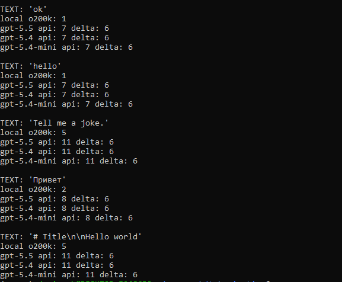

# Tokenization premium: Russian vs English Markdown

This repository contains an experiment on how many tokens Russian, English, and
mixed-language Markdown instructions use in LLM agent workflows.

The central question is: **how much more expensive Russian Markdown is than
English Markdown in token count, and how that gap changes across tokenizers and
API token counters**.

The project does not claim that "Russian is always more expensive than English"
in one universal sense. It measures a narrower and more testable question: the
ratio between the token count of a Russian or mixed-language version and an
English baseline with the same intended meaning.

## What Is Measured

The project separates three measurement levels. They should not be merged into
one metric:

| Level                      | Meaning                                                        | Project status                         |
| :------------------------- | :------------------------------------------------------------- | :------------------------------------- |
| Raw tokenizer count        | Local token count from a specific tokenizer                    | Measured for OpenAI `tiktoken`         |
| Official API token count   | Official input-token counter from a specific model/API         | Measured for OpenAI and Gemini         |
| API usage / billable usage | Actual `usage` after a real request and possible billing usage | Not yet treated as the final metric    |

For that reason, the current tables should not be read as final request cost.
They compare tokenization and API-level input counts, not pricing.

## Why Markdown

Plain parallel text is useful as a neutral baseline, but LLM developers often
send models Markdown files rather than plain text: `AGENTS.md`, `CLAUDE.md`,
`README.md`, implementation plans, project rules, and layer docs.

These files contain more than natural language:

| Element                 | Example                                   |
| :---------------------- | :---------------------------------------- |
| Headings                | `## Verification`                         |
| Lists                   | `- Run tests before final response`       |
| Inline code             | `` `pytest` ``                            |
| File paths              | `scripts/count_openai_tiktoken.py`        |
| Commands                | `python scripts/count_openai_tiktoken.py` |
| English technical labels | `provider boundary`, `API usage`         |

Because of this, practical Markdown samples behave differently from ordinary
corpus prose: code-like elements and English technical terms reduce the share of
pure Russian text in the total input.

## Dataset

The experiment uses two kinds of data:

| Data type                   | What it tests                                  |
| :-------------------------- | :--------------------------------------------- |
| FLORES+ corpus baseline     | Neutral parallel RU/EN prose                   |
| Practical Markdown samples  | Files resembling real agent/context prompts    |

Practical samples:

| Sample                  | What it represents                            | Comparison              |
| :---------------------- | :-------------------------------------------- | :---------------------- |
| `dev_prompt`            | A task for a coding agent                     | `*_ru.md` vs `*_en.md`  |
| `project_rules`         | `AGENTS.md` / project-level rules             | `*_ru.md` vs `*_en.md`  |
| `system_prompt`         | A long system instruction                     | `*_ru.md` vs `*_en.md`  |
| `implementation_plan`   | A mixed-language implementation plan          | `*_mixed.md` vs `*_en.md` |
| `flores`                | Neutral corpus baseline                       | `*_ru.md` vs `*_en.md`  |

The mixed sample does not replace the strict RU/EN comparison. It is a separate
practical case where Russian explanations appear next to commands, file paths,
identifiers, and English engineering terms.

## Results Summary

`Ratio` shows how many times longer the compared file is than the English
baseline by token count.

| Sample                  | Comparison | OpenAI `cl100k_base` | OpenAI `o200k_base` | OpenAI current API | Gemini official | Claude |
| :---------------------- | :--------- | -------------------: | ------------------: | -----------------: | --------------: | :----- |
| `dev_prompt`            | `ru_en`    |               1.455x |              1.088x |             1.088x |          1.065x | TODO   |
| `project_rules`         | `ru_en`    |               1.573x |              1.140x |             1.139x |          1.112x | TODO   |
| `system_prompt`         | `ru_en`    |               1.792x |              1.154x |             1.153x |          1.111x | TODO   |
| `implementation_plan`   | `mixed_en` |               1.399x |              1.101x |             1.100x |          1.090x | TODO   |
| `flores`                | `ru_en`    |               2.492x |              1.463x |             1.463x |          1.400x | TODO   |

What stands out:

- The older OpenAI `cl100k_base` baseline shows the largest RU/EN gap.
- The newer OpenAI `o200k_base` sharply reduces the gap on Markdown samples.
- OpenAI current API input counts are almost identical to `o200k_base` ratios.
- Gemini official `countTokens` shows a slightly smaller gap than OpenAI current API.
- FLORES shows a larger gap than practical Markdown across all measured providers.

## Detailed Measurements

| Sample                  | Source              | Model / encoding     | EN tokens | RU / mixed tokens | Ratio  | Measurement level              |
| :---------------------- | :------------------ | :------------------- | --------: | ----------------: | -----: | :----------------------------- |
| `dev_prompt`            | OpenAI tiktoken     | `cl100k_base`        |     1,027 |             1,494 | 1.455x | local raw tokenizer count      |
| `dev_prompt`            | OpenAI tiktoken     | `o200k_base`         |     1,018 |             1,108 | 1.088x | local raw tokenizer count      |
| `dev_prompt`            | OpenAI current API  | `gpt-5.5`            |     1,024 |             1,114 | 1.088x | Responses input token count    |
| `dev_prompt`            | Gemini official     | `gemini-2.5-flash`   |     1,140 |             1,214 | 1.065x | official countTokens           |
| `project_rules`         | OpenAI tiktoken     | `cl100k_base`        |     1,098 |             1,727 | 1.573x | local raw tokenizer count      |
| `project_rules`         | OpenAI tiktoken     | `o200k_base`         |     1,094 |             1,247 | 1.140x | local raw tokenizer count      |
| `project_rules`         | OpenAI current API  | `gpt-5.5`            |     1,100 |             1,253 | 1.139x | Responses input token count    |
| `project_rules`         | Gemini official     | `gemini-2.5-flash`   |     1,193 |             1,327 | 1.112x | official countTokens           |
| `system_prompt`         | OpenAI tiktoken     | `cl100k_base`        |       877 |             1,572 | 1.792x | local raw tokenizer count      |
| `system_prompt`         | OpenAI tiktoken     | `o200k_base`         |       870 |             1,004 | 1.154x | local raw tokenizer count      |
| `system_prompt`         | OpenAI current API  | `gpt-5.5`            |       876 |             1,010 | 1.153x | Responses input token count    |
| `system_prompt`         | Gemini official     | `gemini-2.5-flash`   |       946 |             1,051 | 1.111x | official countTokens           |
| `implementation_plan`   | OpenAI tiktoken     | `cl100k_base`        |     1,074 |             1,503 | 1.399x | local raw tokenizer count      |
| `implementation_plan`   | OpenAI tiktoken     | `o200k_base`         |     1,072 |             1,180 | 1.101x | local raw tokenizer count      |
| `implementation_plan`   | OpenAI current API  | `gpt-5.5`            |     1,078 |             1,186 | 1.100x | Responses input token count    |
| `implementation_plan`   | Gemini official     | `gemini-2.5-flash`   |     1,204 |             1,312 | 1.090x | official countTokens           |
| `flores`                | OpenAI tiktoken     | `cl100k_base`        |     5,469 |            13,629 | 2.492x | local raw tokenizer count      |
| `flores`                | OpenAI tiktoken     | `o200k_base`         |     5,440 |             7,959 | 1.463x | local raw tokenizer count      |
| `flores`                | OpenAI current API  | `gpt-5.5`            |     5,446 |             7,965 | 1.463x | Responses input token count    |
| `flores`                | Gemini official     | `gemini-2.5-flash`   |     5,777 |             8,086 | 1.400x | official countTokens           |

## Comparison With Local `o200k_base`

For the tested Markdown samples and payload style `input=text`, the OpenAI
Responses input-token counter returned the local `o200k_base` count plus a
constant 6-token overhead.

| Sample                  | `o200k_base` EN | OpenAI API EN | Delta EN | `o200k_base` RU / mixed | OpenAI API RU / mixed | Delta RU / mixed |
| :---------------------- | --------------: | ------------: | -------: | ----------------------: | --------------------: | ---------------: |
| `dev_prompt`            |           1,018 |         1,024 |       +6 |                   1,108 |                 1,114 |               +6 |
| `project_rules`         |           1,094 |         1,100 |       +6 |                   1,247 |                 1,253 |               +6 |
| `system_prompt`         |             870 |           876 |       +6 |                   1,004 |                 1,010 |               +6 |
| `implementation_plan`   |           1,072 |         1,078 |       +6 |                   1,180 |                 1,186 |               +6 |
| `flores`                |           5,440 |         5,446 |       +6 |                   7,959 |                 7,965 |               +6 |

The same `+6` delta also appeared on short test strings (`ok`, `hello`,
`Tell me a joke.`, `Привет`, and a small Markdown heading) for `gpt-5.5`,
`gpt-5.4`, and `gpt-5.4-mini`:



This does not prove that the internal tokenizer of these models is officially
named `o200k_base`. It only shows that, for this dataset and this API payload
style, the API-level input-token count closely matches local `o200k_base` with a
small constant wrapper overhead. With `instructions=text` and a minimal
`input="ok"`, the observed overhead was `+11` tokens instead of `+6`; in both
cases the overhead was symmetric for the English baseline and the Russian or
mixed compared text, so the ratios changed only minimally.

## Markdown Decomposition

To check whether Markdown structure is diluting the RU/EN gap, the practical
samples were decomposed into:

| Variant     | Meaning                                                        |
| :---------- | :------------------------------------------------------------- |
| Full        | Original Markdown file with prose, headings, lists, code, paths |
| Prose-only  | Markdown/code-like structure removed, leaving natural language  |

The key result: after removing structural Markdown and code-like fragments, the
RU/EN gap becomes larger. That supports the interpretation that practical
developer Markdown is not just "Russian prose in a Markdown file"; it is a mixed
object where language-neutral and English-heavy technical fragments reduce the
overall language gap.

`o200k_base` results:

| Sample                  | Comparison | Full ratio | Prose-only ratio | Delta   | EN structural share | RU/mixed structural share |
| :---------------------- | :--------- | ---------: | ---------------: | ------: | ------------------: | ------------------------: |
| `dev_prompt`            | `ru_en`    |     1.088x |           1.149x | +0.061x |              30.26% |                    26.35% |
| `project_rules`         | `ru_en`    |     1.140x |           1.190x | +0.050x |              23.31% |                    19.97% |
| `system_prompt`         | `ru_en`    |     1.154x |           1.197x | +0.043x |               9.43% |                     6.08% |
| `implementation_plan`   | `mixed_en` |     1.101x |           1.134x | +0.033x |              21.27% |                    18.90% |

The structural share is computed as removed token share:
`(full_tokens - prose_only_tokens) / full_tokens`. A separate `structure_only`
RU/EN ratio is intentionally not used, because extracted Markdown structure is
not a semantic translation pair.

## Length And Density Controls

The next control asks a different question: is FLORES higher simply because it
is longer than the practical Markdown files?

The answer appears to be no. When FLORES is split into aligned chunks whose
English side is roughly the same size as each practical Markdown sample, the
RU/EN token ratio remains close to the full FLORES result.

`o200k_base` length/density results:

| Sample                  | Comparison | Char ratio | Token ratio | Tokens/char ratio | Token ratio - char ratio |
| :---------------------- | :--------- | ---------: | ----------: | ----------------: | -----------------------: |
| `dev_prompt`            | `ru_en`    |     0.957x |      1.088x |            1.137x |                  +0.131x |
| `project_rules`         | `ru_en`    |     0.981x |      1.140x |            1.162x |                  +0.159x |
| `system_prompt`         | `ru_en`    |     0.983x |      1.154x |            1.173x |                  +0.171x |
| `implementation_plan`   | `mixed_en` |     1.012x |      1.101x |            1.088x |                  +0.089x |
| `flores`                | `ru_en`    |     1.117x |      1.463x |            1.309x |                  +0.346x |

FLORES chunk-size control, also on `o200k_base`:

| Target size like        | Chunks | Median token ratio | Mean token ratio | Median char ratio | Median tokens/char ratio |
| :---------------------- | -----: | -----------------: | ---------------: | ----------------: | -----------------------: |
| `dev_prompt`            |      5 |             1.474x |           1.464x |            1.109x |                   1.320x |
| `project_rules`         |      5 |             1.459x |           1.463x |            1.114x |                   1.307x |
| `system_prompt`         |      6 |             1.465x |           1.463x |            1.115x |                   1.308x |
| `implementation_plan`   |      5 |             1.454x |           1.463x |            1.115x |                   1.305x |

This strengthens the earlier interpretation: practical Markdown has a smaller
RU/EN gap not because the files are shorter, but because they are a different
genre. They contain short imperative instructions, Markdown syntax, commands,
file paths, API terms, identifiers, and English technical labels. FLORES
measures ordinary parallel prose; practical Markdown measures developer context
files. Treating both as one universal "Russian costs X% more" number would be
methodologically misleading.

## Interim Conclusion

Russian tokenization premium still exists, but its size depends on the
tokenizer, API counter, and text type.

On the neutral FLORES baseline, the gap remains visible:

| Measurement          | RU/EN ratio |
| :------------------- | ----------: |
| OpenAI current API   |      1.463x |
| Gemini official      |      1.400x |

On practical Markdown instructions, the gap is much smaller:

| Measurement          | Practical Markdown RU/EN range |
| :------------------- | ------------------------------: |
| OpenAI current API   |                  1.088x-1.153x |
| Gemini official      |                  1.065x-1.112x |

In other words, the claim "Russian is more expensive than English" needs
qualification. On ordinary parallel prose, the gap can be large. On
agent-oriented Markdown files with commands, file paths, inline code, and
English technical labels, it becomes substantially smaller.

The decomposition and length/density controls make that conclusion stronger:
Markdown samples are not lower-gap merely because they are shorter. FLORES-sized
controls remain high, while removing Markdown/code-like structure from practical
samples increases the RU/EN ratio.

## Project Structure

| Path                          | Purpose                                      |
| :---------------------------- | :------------------------------------------- |
| `data/samples/`               | Markdown samples for comparison              |
| `scripts/`                    | Data preparation and token counting scripts  |
| `results/`                    | Generated CSV and metadata summaries         |
| `requirements.txt`            | Python dependencies                          |

## Reproduce

```bash
python scripts/count_openai_tiktoken.py
python scripts/count_openai_current_model_input_tokens.py --models gpt-5.5 gpt-5.4 gpt-5.4-mini
python scripts/count_markdown_decomposition_v2_tiktoken.py
python scripts/length_density_controls.py
python scripts/build_cross_model_summary.py
```

API-level measurements require the relevant provider keys in the environment.
API keys and local `.env` files should not be committed to Git.

## Work In Progress

This work is still in progress. Next steps:

- compare Claude official token count;
- check actual API usage on real requests;
- calculate pricing scenarios separately, including input/output tokens,
  caching, and the billing rules of specific models.
